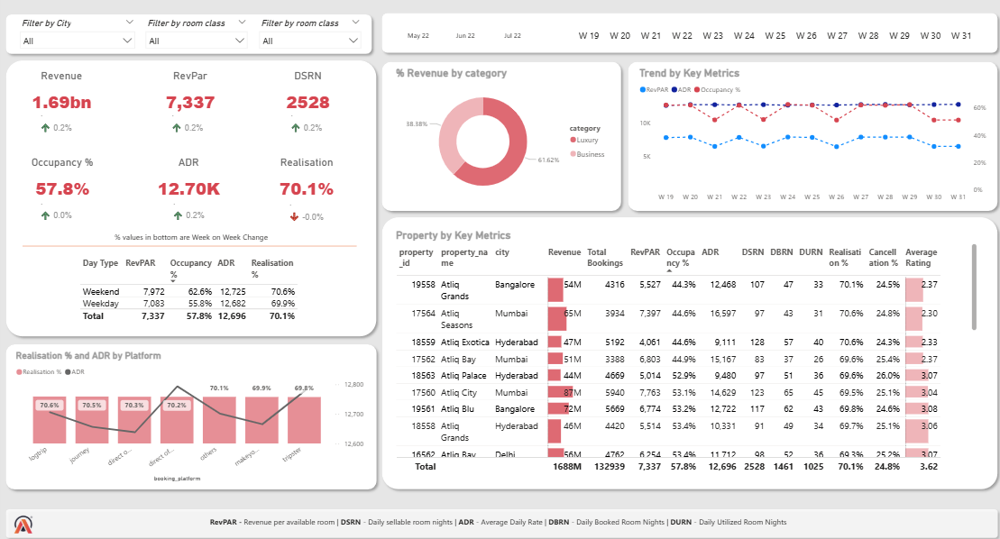

### 🏨 Hospitality KPI Dashboard (Power BI)

An interactive Power BI dashboard built to track key performance metrics for a hotel chain, including Occupancy Rate, ADR, and RevPAR. The dashboard allows dynamic filtering by property type and region, helping identify underperforming locations and seasonal trends.

**Tools:** Power BI, Power Query, DAX  
**KPIs:** Occupancy Rate, ADR, RevPAR, Booking Trends  

#### 📷 Screenshot  

